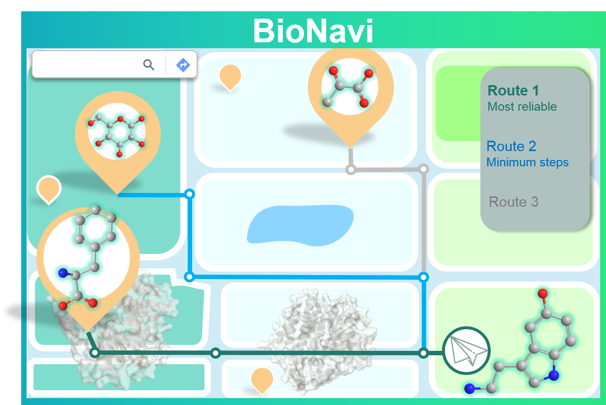

#### Introduction
Source code for the paper "Deep Learning Driven Biosynthesis Pathways Navigation for Natural Products with  BioNavi-NP". (Soon to be published in *Nature Communication*)



####  Setup
BioNavi requires anaconda with python 3.7 or later. 

You will wish to install BioNavi in a virtual environment to prevent conflicting dependencies.

```python
sudo apt-get install graphviz # optional: for output visualization
conda create -n bionavi python==3.7
conda activate bionavi
sh install.sh
```

####  Precursor prediction
We provide the pre-trained ensemble models for precursor prediction, these models can be used to pathway planning.
You can also train your own models with following steps:
### preprocess the data

```python
onmt_build_vocab -config vocab.yaml -n_sample -1
```

### train the model

```python
onmt_train -config config/single_train.yaml
```

### make prediction

```python
onmt_translate -src precursor_prediction/data/test_src.txt -output precursor_prediction/prediction/pred_tgt.txt \
                    -batch_size 32 -replace_unk -beam_size 10 -n_best 10 -gpu 0 \
                    -model precursor_prediction/checkpoints/retrosyn_step_40000.pt precursor_prediction/checkpoints/retrosyn_step_50000.pt \
                        precursor_prediction/checkpoints/retrosyn_step_60000.pt precursor_prediction/checkpoints/retrosyn_step_90000.pt
```
Note: here the models of 40000,50000,60000,90000 step were selected according to the performance validation set, you may need to choose differnet ones according to your own models.  
### evaluate the prediction

```python

python script/eval_single.py -targets precursor_prediction/data/test_tgt.txt \
                    -predictions precursor_prediction/prediction/pred_tgt.txt \
                    -invalid_smiles -beam_size 10 \
```

#### Pathway planning
You can set the parameters by ```config/bionavi_conf.yaml```, then run

```python

python run_bionavi.py
```

#### Testing on the test set

Our work on BioNavi features an evaluation on our test-set. We automated this evaluation by

```python
python run_bionavi_batch.py
```

#### Evaluate the pathway prediction

```python
python script/eval_pathway.py
```